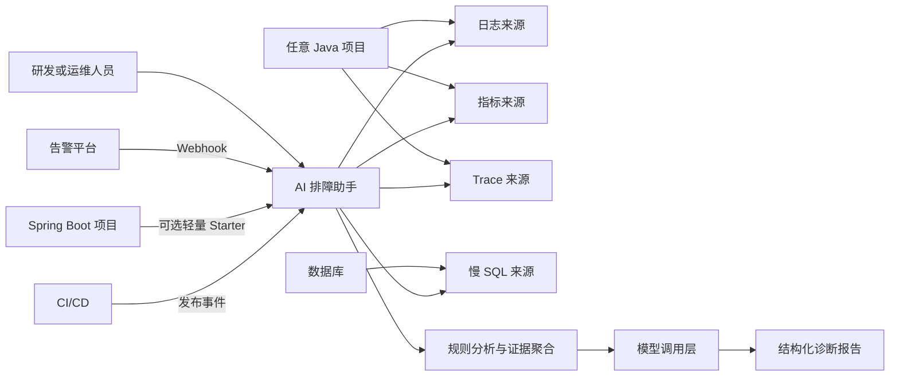
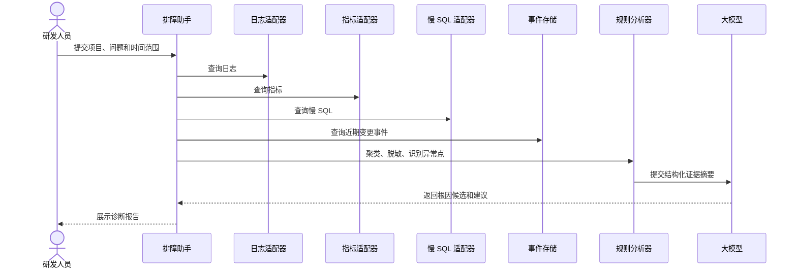

# FaultPilot Java 故障排查与监控助手系统设计方案

版本：V1.6
日期：2026-06-01
目标：面向通用 Java 项目的可扩展开源方案

> 对应统一规格：`docs/specification.md` V1.6。核心算法、预算、安全和范围以统一规格为准。

## 1. 设计原则

- 独立部署：助手与业务项目解耦，可服务多个 Java 项目。
- 协议优先：不同项目遵守统一接入规范，而不是为每个项目定制诊断代码。
- 渐进增强：项目可以从 L1 日志接入开始，逐步增加指标、慢 SQL 和 Trace。
- 只读优先：默认仅查询、聚合和解释，不执行高风险动作。
- 数据先于模型：监控组件负责采集，助手负责关联，模型负责解释证据。
- 默认脱敏：日志和 SQL 进入模型前必须过滤、截断和参数化。
- Starter 可选：Spring Boot Starter 只降低接入成本，不改变助手独立部署的边界。

## 2. 总体架构



助手不需要与业务项目部署在同一台服务器。业务项目只需按接入等级提供可访问的数据源或推送事件。

Spring Boot Starter 是可选接入组件。它不嵌入 AI 诊断逻辑，只将经过脱敏和限流的事件异步推送到助手。

## 3. 接入协议

### 3.1 项目标识

每个项目必须注册：

| 字段 | 必填 | 示例 | 用途 |
| --- | --- | --- | --- |
| `projectId` | 是 | `order-service` | 全局唯一标识 |
| `displayName` | 是 | `Order Service` | 页面展示 |
| `environment` | 是 | `production` | 隔离不同环境 |
| `integrationLevel` | 是 | `L2` | 声明已接入能力 |
| `tags` | 否 | `java,spring-boot` | 检索和分类 |

### 3.2 标准日志事件

所有日志适配器最终转换为统一模型：

```json
{
  "projectId": "order-service",
  "environment": "production",
  "occurredAt": "2026-06-01T10:12:31+08:00",
  "level": "ERROR",
  "logger": "com.example.order.OrderService",
  "traceId": "80E40F...",
  "message": "Create order failed",
  "stackTrace": "java.lang.IllegalStateException: ...",
  "attributes": {
    "exceptionClass": "IllegalStateException"
  }
}
```

### 3.3 标准指标

指标适配器至少支持：

| 类别 | 指标 |
| --- | --- |
| HTTP 或 RPC | QPS、错误率、平均耗时、P95、P99 |
| JVM | Heap、Non-Heap、线程数、GC 次数和耗时 |
| 数据库连接池 | 活跃连接、空闲连接、等待数 |
| 服务器 | CPU、内存、磁盘、网络 |
| 业务指标 | 项目自定义，例如失败率和积压量 |

### 3.4 标准变更事件

```json
{
  "projectId": "order-service",
  "environment": "production",
  "type": "DEPLOYMENT",
  "occurredAt": "2026-06-01T09:32:00+08:00",
  "attributes": {
    "version": "v1.4.2",
    "commitId": "abc123"
  }
}
```

`type` 首期支持：

- `DEPLOYMENT`
- `ROLLBACK`
- `CONFIG_CHANGE`
- `SERVICE_RESTART`
- `JOB_STARTED`
- `JOB_COMPLETED`
- `JOB_FAILED`
- `BUSINESS_EVENT`

### 3.5 标准慢 SQL 事件

```json
{
  "projectId": "order-service",
  "environment": "production",
  "occurredAt": "2026-06-01T10:12:31+08:00",
  "traceId": "80E40F...",
  "durationMs": 2350,
  "sqlTemplate": "select * from orders where customer_id = ?",
  "source": "mysql-slow-log"
}
```

只允许传递参数化 SQL 模板，不允许传递真实业务参数。

## 4. Java 项目接入方式

### 4.1 Spring Boot 项目：外部数据源方式

推荐组合：

```text
Spring Boot Actuator
+ Micrometer Prometheus Registry
+ 日志采集器
+ 可选 OpenTelemetry Java Agent
+ CI/CD 发布事件
```

Spring Boot 项目可增加官方监控依赖：

```xml
<dependency>
    <groupId>org.springframework.boot</groupId>
    <artifactId>spring-boot-starter-actuator</artifactId>
</dependency>
<dependency>
    <groupId>io.micrometer</groupId>
    <artifactId>micrometer-registry-prometheus</artifactId>
</dependency>
```

配置：

```yaml
management:
  endpoints:
    web:
      exposure:
        include: health,prometheus
```

### 4.2 Spring Boot 项目：可选 Starter 方式

Starter 适用于希望低成本接入慢接口和异常事件上报的 Spring Boot 项目。它不是完整助手，也不是必选依赖。

业务项目引入：

```xml
<dependency>
    <groupId>io.github.example</groupId>
    <artifactId>faultpilot-spring-boot-starter</artifactId>
    <version>0.1.0</version>
</dependency>
```

配置：

```yaml
faultpilot:
  enabled: true
  project-id: order-service
  environment: production
  assistant-url: ${FAULTPILOT_ASSISTANT_URL}
  token: ${FAULTPILOT_TOKEN}
  slow-api-threshold: 2s
  push:
    async: true
    batch-size: 100
    flush-interval: 5s
    max-buffer-size: 1000
    failure-policy: discard-oldest
```

Starter 默认只上报摘要事件：

- 超过阈值的接口耗时和状态码。
- 未处理异常的类型、摘要和 `traceId`。
- 应用启动、停止和健康状态。
- 可选的参数化慢 SQL 模板和耗时。

Starter 不调用模型，不读取业务表，不阻塞请求，不执行任何处置动作。助手服务不可用时，Starter 在固定大小缓冲区内短暂保存事件；达到上限后按策略丢弃。

### 4.3 非 Spring Boot 项目

不要求改造成 Spring Boot。推荐使用：

```text
OpenTelemetry Java Agent
+ JMX Exporter
+ Fluent Bit 或 Filebeat
+ CI/CD 发布事件
```

启动参数示例：

```bash
java \
  -javaagent:/opt/otel/opentelemetry-javaagent.jar \
  -Dotel.service.name=legacy-order-service \
  -jar app.jar
```

### 4.4 日志只存在数据库表的项目

为助手建立只读视图，映射为标准日志事件：

```sql
CREATE VIEW faultpilot_log_view AS
SELECT
    created_at AS occurred_at,
    log_level AS level,
    trace_id,
    message,
    stack_trace
FROM app_log;
```

助手使用固定 SQL 模板、时间范围和最大条数查询。大模型不参与 SQL 生成。

### 4.5 日志只存在文件的项目

服务器安装 Fluent Bit 或 Filebeat，将日志转发到 Loki 或 Elasticsearch。助手通过日志平台查询，不使用 SSH 直接读取服务器文件。

### 4.6 定时任务和批处理项目

除了日志和 JVM 指标，还应推送任务事件：

```json
{
  "projectId": "settlement-job",
  "environment": "production",
  "type": "JOB_FAILED",
  "occurredAt": "2026-06-01T02:13:00+08:00",
  "attributes": {
    "jobName": "daily-settlement",
    "durationMs": 621000
  }
}
```

## 5. 助手内部模块

| 模块 | 责任 |
| --- | --- |
| `DiagnosisController` | 接收人工诊断请求，返回报告 |
| `AlertWebhookController` | 接收告警系统事件 |
| `EventController` | 接收发布、任务和业务事件 |
| `ProjectRegistry` | 加载项目配置，校验环境和接入等级 |
| `EvidenceCollector` | 编排适配器，收集证据 |
| `EvidenceSanitizer` | 脱敏、截断、去重和 SQL 参数化 |
| `RuleAnalyzer` | 识别突增、相关性和明显异常 |
| `AiDiagnosisService` | 调用模型，输出结构化结果 |
| `DiagnosisRepository` | 保存任务、报告和审计记录 |
| `IngestionController` | 接收 Starter 异步批量推送的脱敏事件 |

## 6. 适配器设计

助手通过 SPI 扩展数据源：

```java
public interface LogSourceAdapter {
    List<LogEvent> query(LogQuery query);
}

public interface MetricSourceAdapter {
    List<MetricSeries> query(MetricQuery query);
}

public interface SlowSqlSourceAdapter {
    List<SlowSqlEvent> query(SlowSqlQuery query);
}

public interface TraceSourceAdapter {
    List<TraceEvent> query(TraceQuery query);
}

public interface DatabaseHealthSourceAdapter {
    DatabaseHealthSnapshot query(DatabaseHealthQuery query);
}
```

首期实现：

- `MockLogSourceAdapter`
- `JdbcLogSourceAdapter`
- `MockMetricSourceAdapter`
- `MockSlowSqlSourceAdapter`
- `MysqlDatabaseHealthSourceAdapter`
- `PostgresDatabaseHealthSourceAdapter`
- `MysqlSlowSqlSourceAdapter`：读取 `performance_schema.events_statements_summary_by_digest` 等数据库统计视图，不解析 Slow Query Log 文件
- `PostgresSlowSqlSourceAdapter`：读取 `pg_stat_statements` 等数据库统计视图，不解析 Slow Query Log 文件
- `WebhookDeploymentSourceAdapter`

后续实现：

- `PrometheusMetricSourceAdapter`
- `LokiLogSourceAdapter`
- `ElasticsearchLogSourceAdapter`
- `OpenTelemetryTraceSourceAdapter`
- `MysqlSlowLogSourceAdapter`

## 7. Starter 模块设计

Starter 独立发布为 Maven 模块：

```text
faultpilot-spring-boot-starter/
├── autoconfigure/
│   ├── FaultPilotAutoConfiguration.java
│   └── FaultPilotProperties.java
├── web/
│   └── SlowApiInterceptor.java
├── exception/
│   └── ExceptionEventListener.java
├── sql/
│   └── SlowSqlEventListener.java
├── lifecycle/
│   └── ApplicationLifecycleListener.java
├── sanitize/
│   └── EventSanitizer.java
└── push/
    ├── EventBuffer.java
    └── AsyncEventPublisher.java
```

### 7.1 上报协议

```http
POST /api/v1/ingestion/events:batch
Content-Type: application/json
Authorization: Bearer ${FAULTPILOT_TOKEN}
```

```json
{
  "projectId": "order-service",
  "environment": "production",
  "instanceId": "order-service-01",
  "events": [
    {
      "type": "SLOW_API",
      "occurredAt": "2026-06-01T10:12:31+08:00",
      "traceId": "80E40F...",
      "attributes": {
        "method": "POST",
        "uri": "/orders",
        "durationMs": 2350,
        "status": 200
      }
    }
  ]
}
```

### 7.2 故障隔离

- 业务请求线程只负责写入有界内存队列。
- 后台线程按批次和时间间隔推送。
- 推送失败采用有限重试和退避。
- 队列达到上限后按配置丢弃旧事件或新事件。
- Starter 内部异常仅记录受限日志，不向业务调用方抛出。
- 默认不将完整请求体、响应体和 SQL 参数写入事件。

## 8. 慢接口监控设计

Prometheus 查询接口 P95：

```promql
histogram_quantile(
  0.95,
  sum by (le, uri, method, application) (
    rate(http_server_requests_seconds_bucket[5m])
  )
)
```

告警触发后，助手执行：

1. 查询接口 P95、P99、QPS 和错误率。
2. 查询同期 JVM、GC、连接池和服务器指标。
3. 查询同时间段应用日志和异常。
4. 查询近期发布事件。
5. 如已接入慢 SQL，查询高频慢 SQL 模板。
6. 生成流量、JVM、连接池、外部依赖和 SQL 等根因候选。

## 9. 慢 SQL 监控设计

| 方案 | 优点 | 局限 | 建议 |
| --- | --- | --- | --- |
| 数据库 Slow Query Log | 数据库原生、低侵入 | 不容易直接关联请求 | 基础方案 |
| `datasource-proxy` 或 `p6spy` | 可关联应用 `traceId` | 增加应用日志量和性能开销 | 按需启用 |
| OpenTelemetry 数据库 Span | 可接入 Trace | 依赖链路采集和后端存储 | L3 推荐 |
| Mock JSON | 无外部依赖 | 仅适合演示 | MVP 使用 |

助手只生成优化建议，不自动运行 `EXPLAIN` 或 `CREATE INDEX`。

### 9.1 MySQL 本地分析

数据库账号只授予查询统计信息所需的最小权限。助手使用内置 SQL 查询：

- `SHOW GLOBAL STATUS` 中的连接和线程状态。
- `performance_schema.events_statements_summary_by_digest` 中的 SQL 摘要。
- `information_schema.innodb_trx` 中的长事务。
- `performance_schema.data_lock_waits` 中的锁等待，权限不足时跳过。

慢 SQL 结果必须转换为参数化模板，不发送真实参数。

### 9.2 PostgreSQL 本地分析

助手使用内置 SQL 查询：

- `pg_stat_activity` 中的连接、长事务和等待状态。
- `pg_locks` 中的锁等待。
- `pg_stat_statements` 中的 SQL 摘要；扩展未启用时跳过并给出提示。

### 9.3 数据库故障隔离

- 每次查询必须设置连接超时和执行超时。
- 查询失败只标记对应证据源不可用，不影响其他日志和模型分析。
- 默认不执行 `EXPLAIN ANALYZE`，避免在业务数据库执行真实 SQL。
- 不执行写操作、终止连接或配置修改。

## 10. 项目配置示例

### 10.1 L1：数据库日志表

```yaml
faultpilot:
  projects:
    - id: legacy-order-service
      display-name: Legacy Order Service
      integration-level: L1
      environments:
        - production
      logs:
        type: jdbc
        url: ${ORDER_LOG_DB_URL}
        username: ${ORDER_LOG_DB_USERNAME}
        password: ${ORDER_LOG_DB_PASSWORD}
        view: faultpilot_log_view
        max-query-hours: 24
        max-results: 500
```

### 10.2 L2：Spring Boot + Prometheus

```yaml
faultpilot:
  projects:
    - id: payment-service
      display-name: Payment Service
      integration-level: L2
      environments:
        - production
      logs:
        type: loki
        base-url: ${LOKI_BASE_URL}
        label-selector: app="payment-service"
      metrics:
        type: prometheus
        base-url: ${PROMETHEUS_BASE_URL}
        application-label: payment-service
```

### 10.3 L2：Spring Boot + 可选 Starter

```yaml
faultpilot:
  enabled: true
  project-id: inventory-service
  environment: production
  assistant-url: ${FAULTPILOT_ASSISTANT_URL}
  token: ${FAULTPILOT_TOKEN}
  slow-api-threshold: 1500ms
  push:
    async: true
    max-buffer-size: 1000
```

## 11. 诊断 API

```http
POST /api/v1/diagnoses
Content-Type: application/json
```

```json
{
  "projectId": "order-service",
  "environment": "production",
  "question": "为什么订单创建接口变慢？",
  "from": "2026-06-01T09:00:00+08:00",
  "to": "2026-06-01T11:00:00+08:00"
}
```

响应：

```json
{
  "diagnosisId": "diag-20260601-001",
  "summary": "订单创建接口在 10:05 后明显变慢",
  "timeline": [],
  "rootCauseCandidates": [],
  "recommendedActions": [],
  "evidence": []
}
```

## 12. 告警和事件 API

```http
POST /api/v1/alerts
POST /api/v1/events
```

所有事件必须包含 `projectId`、`environment`、`type` 和 `occurredAt`。

### 12.1 Ingestion 安全约束

Starter 或其他采集端写入：

```http
POST /api/v1/ingestion/events:batch
```

必须校验：

- Bearer Token 绑定 `projectId` 和允许的环境集合。
- 请求项目与 Token 不匹配时返回 `403`。
- 单批最大条数、单事件大小和单批总大小。
- Token 级每分钟限流。
- `requestId` 幂等去重。
- `sentAt` 时间窗口，默认超过 5 分钟拒绝。
- 审计记录项目、Token 标识、数量和拒绝原因。

## 13. 诊断流程



## 14. 代码结构建议

```text
src/main/java/io/github/atomoty/faultpilot/
├── controller/
├── service/
├── adapter/
│   ├── jdbc/
│   ├── mock/
│   ├── prometheus/
│   ├── loki/
│   ├── elasticsearch/
│   └── opentelemetry/
├── model/
├── config/
└── security/
```

## 15. 分阶段实施计划

### 阶段一：开源 MVP

- 新建独立 Spring Boot 助手项目。
- 实现项目注册、诊断 API、Mock 数据和 Mock 模型。
- 实现 JDBC 日志适配器和事件推送 API。
- 准备异常排查和慢接口关联慢 SQL 两个通用案例。
- 编写 README、接入规范、示例项目和脱敏说明。
- Starter 不作为 MVP 阻塞项，先固定上报协议。

### 阶段二：标准监控能力

- 实现 Prometheus 指标适配器。
- 提供 Spring Boot Actuator 接入示例。
- 提供 OpenTelemetry Java Agent 和 JMX Exporter 指南。
- 实现 Alertmanager Webhook。
- 接入 Loki 或 Elasticsearch 至少一种日志平台。
- 实现可选 Spring Boot Starter，验证助手不可用时业务不受影响。

### 阶段三：增强排障能力

- 接入数据库 Slow Query Log 文件解析。MVP 已支持数据库统计视图中的慢 SQL 摘要。
- 接入 OpenTelemetry Trace。
- 增加历史案例检索和通知渠道。
- 根据社区需求扩展更多适配器。

## 16. 安全设计

- 助手仅使用只读账号和受限 Token。
- 模型调用前执行脱敏、去重、截断和 SQL 参数化。
- 不使用 SSH，不执行 Shell，不运行模型生成的 SQL。
- 每次查询记录用户、项目、时间范围、数据源、返回条数和诊断 ID。
- 公开 GitHub 仓库只包含虚构数据和占位符配置。
- Starter Token 只允许写入所属项目事件，不允许读取诊断报告或其他项目数据。

## 17. 测试策略

| 测试类型 | 重点 |
| --- | --- |
| 单元测试 | 时间范围、最大条数、脱敏、聚类和规则判断 |
| 适配器测试 | JDBC 固定 SQL、Mock、Prometheus 和日志平台查询 |
| 集成测试 | 从诊断请求到结构化报告的完整流程 |
| 安全测试 | SQL 注入、越权访问和敏感信息过滤 |
| 示例验证 | Spring Boot、普通 JVM 和 JDBC 日志表三类接入 |
| Starter 隔离测试 | 助手超时、拒绝连接、缓冲区满和序列化异常时业务请求不受影响 |

## 18. MVP 技术选型冻结

| 项目 | 选择 |
| --- | --- |
| Java | Java 17 |
| 框架 | Spring Boot 3.x |
| 构建工具 | Maven |
| 数据库 | H2 用于默认演示；PostgreSQL 或 MySQL 用于部署 |
| 数据访问 | Spring JDBC，避免为适配器引入复杂 ORM |
| 配置 | `application.yml` + 环境变量 |
| 模型接口 | OpenAI API HTTP 接口 |
| JSON | Jackson |
| 测试 | JUnit 5、Spring Boot Test、Testcontainers 可选 |
| 部署 | Dockerfile + Docker Compose |

MVP 默认使用 H2、Mock 数据和 Mock 模型启动，不依赖外部服务。

## 19. MVP 持久化模型

助手自身只保存项目配置之外的运行数据，不复制业务系统全部原始日志。

| 表 | 用途 | 核心字段 |
| --- | --- | --- |
| `faultpilot_event` | 保存发布、回滚、任务和 Starter 事件 | `id`、`project_id`、`environment`、`type`、`occurred_at`、`attributes_json` |
| `diagnosis_task` | 保存诊断请求和状态 | `id`、`project_id`、`environment`、`question`、`from_time`、`to_time`、`status` |
| `diagnosis_report` | 保存结构化报告 | `task_id`、`summary`、`timeline_json`、`root_causes_json`、`actions_json`、`evidence_json` |
| `audit_log` | 保存查询审计信息 | `id`、`task_id`、`source_type`、`query_range`、`result_count`、`created_at` |

MVP 的项目注册使用 YAML，不建立项目管理表。后续需要动态管理时再增加数据库配置。

## 20. 模型调用设计

### 20.1 模型适配器

```java
public interface DiagnosisModel {
    DiagnosisReport generate(DiagnosisContext context);
}
```

首期实现：

- `MockDiagnosisModel`
- `OpenAiApiDiagnosisModel`

### 20.2 模型输入

模型只接收结构化摘要：

```json
{
  "question": "为什么订单创建接口变慢？",
  "timeRange": {},
  "logClusters": [],
  "metricAnomalies": [],
  "slowSqlSummaries": [],
  "changeEvents": []
}
```

### 20.3 模型输出

模型必须返回可以反序列化的结构化 JSON：

```json
{
  "summary": "订单创建接口在发布后变慢",
  "timeline": [],
  "rootCauseCandidates": [
    {
      "title": "低效 SQL 导致连接池等待",
      "evidenceStrength": "STRONG",
      "evidenceIds": ["sql-1", "metric-2"]
    }
  ],
  "recommendedActions": []
}
```

模型返回非法 JSON 时，系统记录错误并返回规则分析生成的降级报告。

### 20.4 OpenAI API 模式

线上独立部署和正式本地运行默认使用 API Key：

```yaml
faultpilot:
  ai:
    provider: openai-api
    base-url: ${OPENAI_BASE_URL:https://api.openai.com}
    api-key: ${OPENAI_API_KEY}
    model: ${OPENAI_MODEL}
    timeout: 35s
```

API Key 必须通过环境变量或密钥管理系统注入。

### 20.5 Codex CLI 实验性本地模式

Codex CLI 模式在 v0.1.0 中作为实验性本地 provider 提供，复用开发机上已经登录的 Codex CLI：

```bash
codex login
codex login status
```

助手配置：

```yaml
faultpilot:
  ai:
    provider: codex-cli
    codex-command: codex
    timeout: 120s
```

实现建议：

```text
CodexCliDiagnosisModel
  → 将脱敏后的 DiagnosisContext 写入标准输入
  → 在隔离临时目录调用 codex exec
  → 使用 --ephemeral、--skip-git-repo-check、--sandbox read-only
  → 使用 --output-schema 约束最终报告 JSON
  → 读取最终消息并反序列化
```

约束：

- 仅允许在本地 profile 启用。
- 默认禁用，不用于线上部署。
- 不读取或复制 Codex CLI 的认证文件。
- 不把 Codex 登录令牌传入容器、服务器或远程服务。
- 独立部署必须使用 `openai-api` 模式。
- 调用失败时返回规则分析降级报告。

该模式是基于 Codex CLI 登录能力和非交互 `codex exec` 能力设计的本地便利功能，不是 OpenAI 为第三方后端提供的通用 OAuth 授权流程。官方没有明确说明个人 Codex 登录态可作为第三方通用排障后端自动化调用，使用者需要自行确认符合适用条款。

## 21. 本地开发运行方式

默认启动：

```bash
mvn spring-boot:run
```

默认配置：

```yaml
faultpilot:
  mode: mock
  ai:
    provider: mock
```

真实模型：

```yaml
faultpilot:
  ai:
    provider: openai-api
    base-url: ${OPENAI_BASE_URL:https://api.openai.com}
    api-key: ${OPENAI_API_KEY}
    model: ${OPENAI_MODEL}
```

实验性本地 Codex CLI 设计，MVP 默认禁用：

```yaml
faultpilot:
  ai:
    provider: codex-cli
    codex-command: codex
```

本地 Java 项目日志可以直接配置文件适配器：

```yaml
logs:
  type: local-file
  paths:
    - /Users/example/logs/application.log
```

本地数据库可以配置只读分析适配器：

```yaml
database-health:
  type: mysql
  url: jdbc:mysql://localhost:3306/demo
  username: ${LOCAL_DB_READONLY_USERNAME}
  password: ${LOCAL_DB_READONLY_PASSWORD}
  connect-timeout: 2s
  query-timeout: 3s
```

生产环境再将日志来源替换为 Loki 或 Elasticsearch。

## 22. 独立部署运行方式

独立部署用于线上检测。推荐 Docker Compose 或容器平台部署：

```text
Java 业务项目
  → 日志文件、数据库、Prometheus、日志平台
  → 独立部署的 faultpilot-server
  → OpenAI API
  → 诊断报告
```

线上部署要求：

- 使用 `openai-api` 模式。
- API Key 通过环境变量或 Secret 注入。
- 数据库使用只读账号。
- 日志目录只读挂载。
- 配置网络访问白名单。
- 禁止启用 `codex-cli` profile。

## 23. GitHub 仓库结构

```text
faultpilot/
├── README.md
├── README.zh-CN.md
├── LICENSE
├── CONTRIBUTING.md
├── SECURITY.md
├── CODE_OF_CONDUCT.md
├── .env.example
├── .gitignore
├── .github/
│   ├── workflows/
│   │   ├── ci.yml
│   │   └── secret-scan.yml
│   └── ISSUE_TEMPLATE/
│       ├── bug_report.yml
│       └── feature_request.yml
├── pom.xml
├── docker-compose.yml
├── docs/
│   ├── en/
│   │   ├── getting-started.md
│   │   ├── integration-guide.md
│   │   ├── deployment.md
│   │   └── architecture.md
│   └── zh-CN/
│       ├── getting-started.md
│       ├── integration-guide.md
│       ├── deployment.md
│       └── architecture.md
├── faultpilot-server/
├── faultpilot-spring-boot-starter/
│   └── README.md
├── examples/
│   ├── demo-data/
│   ├── local-file/
│   ├── jdbc-log-table/
│   ├── mysql-local/
│   └── postgres-local/
└── scripts/
    ├── run-local.sh
    └── verify-no-secrets.sh
```

README 语言切换链接：

```markdown
[English](README.md) | [简体中文](README.zh-CN.md)
```

详细规范见 `docs/github-repository-design.md`。

## 24. 核心算法与预算

RuleAnalyzer、时间关联、UTC 规范、突增阈值、模型上下文预算、60 秒链路预算、证据强度和模型数据审计以 `docs/specification.md` 为准。

关键原则：

- 证据适配器并行执行。
- `traceId` 优先，时间窗口关联必须标记强弱。
- 模型输入默认最多 12,000 tokens。
- 模型调用默认超时 35 秒。
- 根因候选使用规则计算的 `EvidenceStrength`，不展示模型自评概率。
- 模型失败时返回规则降级报告。
